# 🌸 Nari (Her Comfort)
### Smart Menstrual Health, Holistic Wellness & IoT Relief Band Companion

[](https://reactnative.dev/)
[](https://expo.dev/)
[](https://www.typescriptlang.org/)
[](https://nodejs.org/)
[](https://www.prisma.io/)
[-0082FC?logo=bluetooth&logoColor=white)](https://espressif.com/)
[](https://nativewind.dev/)

---

## 📖 Table of Contents

- [🌟 Project Vision & Mission](#-project-vision--mission)
- [🎯 What We Do](#-what-we-do)
- [🔬 How We Do It (Architecture & Technology)](#-how-we-do-it-architecture--technology)
- [📱 Screen-by-Screen Walkthrough (Visual Gallery)](#-screen-by-screen-walkthrough-visual-gallery)
  - [1. Welcome & Authentication](#1-welcome--authentication)
  - [2. 4-Digit Passcode & Biometric Security](#2-4-digit-passcode--biometric-security)
  - [3. Today Dashboard & Cycle Prediction](#3-today-dashboard--cycle-prediction)
  - [4. Holistic Wellness & Wearable Relief Hub](#4-holistic-wellness--wearable-relief-hub)
  - [5. Nari AI Health Companion (GPT-4o Health)](#5-nari-ai-health-companion-gpt-4o-health)
  - [6. Personalized Therapy Session Pre-Configuration](#6-personalized-therapy-session-pre-configuration)
  - [7. Session Duration Presets & Therapy Launcher](#7-session-duration-presets--therapy-launcher)
  - [8. Clinical History & Bio-Telemetry Audits](#8-clinical-history--bio-telemetry-audits)
  - [9. AI Clinical Audit & Bioamp Telemetry Report](#9-ai-clinical-audit--bioamp-telemetry-report)
  - [10. Account Profile & Edge AI Health Shield](#10-account-profile--edge-ai-health-shield)
  - [11. Her Comfort ESP32 BLE Device Scanner](#11-her-comfort-esp32-ble-device-scanner)
  - [12. Disaster Health Early Warning (India Shield)](#12-disaster-health-early-warning-india-shield)
  - [13. Reminders & Alerts Hub](#13-reminders--alerts-hub)
- [⚙️ Hardware Integration & Protocol (ESP32-C6)](#️-hardware-integration--protocol-esp32-c6)
- [🏗️ Repository & Directory Structure](#️-repository--directory-structure)
- [🚀 Setup & Installation Guide](#-setup--installation-guide)
  - [Prerequisites](#prerequisites)
  - [Backend Setup (Node.js & MongoDB)](#backend-setup-nodejs--mongodb)
  - [Mobile App Setup (Expo & React Native)](#mobile-app-setup-expo--react-native)
  - [Building Standalone APK vs Dev Client](#building-standalone-apk-vs-dev-client)
- [🔌 API Endpoints Reference](#-api-endpoints-reference)
- [🔐 Privacy & Security Guardrails](#-privacy--security-guardrails)
- [📸 Adding Future Screenshots](#-adding-future-screenshots)

---

## 🌟 Project Vision & Mission

Dysmenorrhea (menstrual cramping) affects up to **80% of menstruating individuals**, frequently resulting in debilitating pelvic pain, lost productivity, and heavy reliance on oral analgesics. Conventional period tracker apps simply record calendar dates on a screen without providing physical relief. Meanwhile, standard heating pads are bulky, untracked, tethered to power cables, and lack physiological feedback or intelligent medical logging.

**Nari (Her Comfort)** closes this loop by uniting **smart IoT wearable technology**, **precision cycle intelligence**, **edge-based AI diagnostics**, and **environmental resilience** into an integrated health platform:

1. **Active Thermo-Vibrational Relief**: Controlled by an **ESP32-C6 microcontroller** with dual heating pads (36°C – 40°C), multi-mode harmonic vibration patterns, and real-time EMG muscle tension biofeedback.
2. **Cycle & Fertility Intelligence**: Mathematical prediction models that forecast period onset, fertile windows, ovulation dates, and hormonal stages.
3. **Clinical Bio-Telemetry & Audit Engine**: Quantifies pain reduction (e.g. Pain 5 → 3, 40% reduction), tracks EMG muscle tone, evaluates thermal regulation, and exports clinical PDF reports.
4. **Context-Aware AI Health Assistant**: Powered by a health-specialized assistant model that directly interfaces with device sensors to recommend custom heat setpoints, stretching protocols, and relief teas.
5. **Edge AI Health & Climate Shield**: On-device anomaly detection, extreme heatwave/AQI disaster advisories, personal vulnerability tuning, and emergency fall detection.
6. **Holistic Lifestyle Tracking**: Biomarker tracking (15 symptoms), mood journals, hydration goals, sleep rest index, vagus nerve breathing calm protocols, and pelvic floor physical therapy.
7. **Zero-Compromise Privacy**: On-device 4-digit session locking, hardware fingerprint / FaceID biometric verification, and encrypted token storage.

---

## 🎯 What We Do

| Feature Pillar | What It Delivers |
| :--- | :--- |
| **Active Thermal & Vibrational Therapy** | Pairs with the Her Comfort Bluetooth wearable band to deliver customizable heat (36°C, 38°C, 39.5°C, 40°C) and harmonic, pulsed, or continuous vibration for targeted pelvic cramp relief. |
| **Bioamp & EMG Muscle Contraction Monitoring** | Measures abdominal tension levels (0–100 RMS scale) in real time to automatically detect spasms and recommend therapy sessions. |
| **Symptom & Pain Delta Tracking** | Enables pre-session pain assessments (0–10 scale), anatomical discomfort localization (Lower Abdomen, Back, Pelvic Floor, Suprapubic), and post-session clinical audit scores. |
| **Precision Cycle & Fertility Forecasting** | Predicts period start dates, fertile windows, and ovulation based on user history, with instant visual indicators on a circular progress ring. |
| **AI Clinical Audits & PDF Exports** | Automatically generates clinical session summaries evaluating pain attenuation percentage, thermal safety regulation, motor intensity, and muscle relaxation. |
| **Edge AI Disaster & Climate Shield** | Delivers real-time heatwave, smog, flood, and cyclone health warnings with adaptive threshold adjustments for commuters, respiratory patients, and pregnancy mode. |
| **Guided Mind-Body Protocols** | 5-minute vagus nerve breathing exercises, pelvic relaxation routines, and cycle-phase nutrition recommendations. |
| **Emergency Fall & Safety Shield** | Wearable accelerometer kinematics with automated fall detection, emergency sirens, and one-touch SOS dispatch to designated contacts. |

---

## 🔬 How We Do It (Architecture & Technology)

```mermaid
graph TD
    subgraph Hardware ["Her Comfort Wearable Band (ESP32-C6)"]
        Sensors["NTC Temp Sensor + Bioamp EMG + 3-Axis Accelerometer"]
        Actuators["Dual Heating Pads + Harmonic Vibration Motors"]
        Firmware["ESP32-C6 Firmware (BLE 5.0 GATT & Classic RFCOMM)"]
    end

    subgraph MobileApp ["Nari Mobile App (React Native / Expo SDK 57)"]
        BLE_Layer["BluetoothContext (react-native-ble-plx)"]
        Security["AppLockContext (Biometrics & 4-Digit PIN)"]
        Router["Expo Router v4 (Tabs & Deep Linking)"]
        StyleEngine["NativeWind v4 & TailwindCSS"]
        AI_Module["Nari AI Assistant (GPT-4o Health API)"]
        EdgeShield["Edge AI Health & Climate Engine"]
    end

    subgraph Backend ["Nari Cloud Services (Node.js & Express 5)"]
        Auth_API["/api/auth (JWT, Google OAuth, Nodemailer OTP)"]
        Cycle_API["/api/cycle (Forecasting Algorithm)"]
        Wellness_API["/api/wellness (Symptom, Hydration & Mood)"]
        Readings_API["/api/readings (Live Telemetry & Audits)"]
        SocketServer["Socket.io WebSocket Server (Port 3000)"]
    end

    subgraph Data ["Persistence Layer"]
        Mongo[("MongoDB Database Cluster")]
        PrismaORM[("Prisma ORM Client 5.22")]
    end

    Hardware <==>|Live Telemetry (500ms) & UTF-8 Commands| MobileApp
    MobileApp <==>|REST JSON & WebSockets| Backend
    Backend <==> PrismaORM <==> Mongo
```

### Technology Highlights

- **Mobile Client**:
  - **Core**: React Native `0.86.3` with Expo SDK `57.0.0`
  - **Navigation**: `expo-router` v4 file-based tabs and stack navigation
  - **Styling**: `nativewind` v4 with custom pink/magenta wellness theme palette
  - **Hardware Protocol**: `react-native-ble-plx` (BLE 5.0) and `react-native-bluetooth-classic`
  - **Biometrics & Security**: `expo-local-authentication`, `expo-secure-store`, `@react-native-async-storage/async-storage`
  - **Animation & Haptics**: `react-native-reanimated` v4, `react-native-gesture-handler`, `expo-haptics`
- **Backend & Cloud Architecture**:
  - **Runtime**: Node.js ES Modules with Express `5.2.1`
  - **Database**: MongoDB paired with Mongoose `9.2.4` and Prisma `5.22.0`
  - **Authentication**: JWT access & refresh tokens, bcryptjs password hashing, Google OAuth2
  - **Real-Time Streaming**: `socket.io` `4.8.3` WebSocket engine
  - **Transactional Email**: Nodemailer with Google OAuth2 transporter for verification OTP codes

---

## 📱 Screen-by-Screen Walkthrough (Visual Gallery)

### 1. Welcome & Authentication
<table align="center">
  <tr>
    <td align="center" width="45%">
      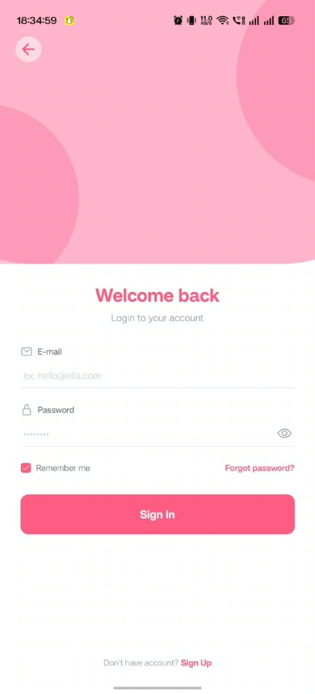
      <br />
      <em>Figure 1: Welcome Back & Sign-In Screen</em>
    </td>
    <td valign="top" width="55%">
      <h4>What it does:</h4>
      <ul>
        <li>Provides a clean, calming gateway into the personal health space.</li>
        <li>Supports email and password credential authentication with inline visibility toggling.</li>
        <li>Features <strong>"Remember me"</strong> session persistence for seamless daily logins.</li>
        <li>Direct links to password recovery (<strong>"Forgot password?"</strong>) and new account registration (<strong>"Sign Up"</strong>).</li>
      </ul>
      <h4>How it works:</h4>
      <ul>
        <li>Implemented in <code>app/login.tsx</code> and integrated with <code>context/AuthContext.tsx</code>.</li>
        <li>Transmits credentials to <code>POST /api/auth/login</code>; upon verification, securely caches encrypted JWT tokens in device storage and transitions to the dashboard.</li>
      </ul>
    </td>
  </tr>
</table>

---

### 2. 4-Digit Passcode & Biometric Security
<table align="center">
  <tr>
    <td align="center" width="45%">
      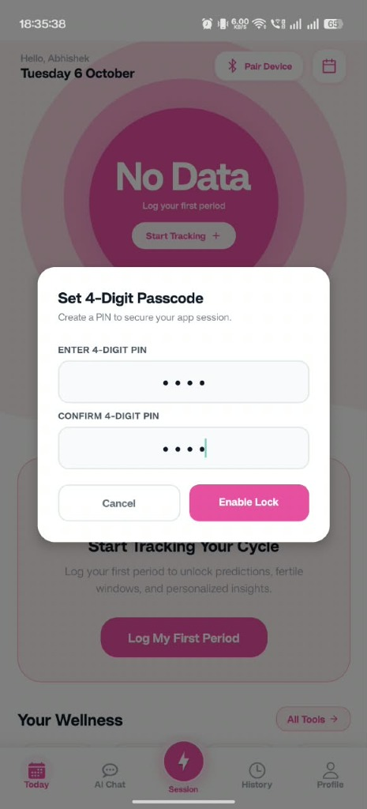
      <br />
      <em>Figure 2: 4-Digit Passcode Setup & Privacy Guard</em>
    </td>
    <td valign="top" width="55%">
      <h4>What it does:</h4>
      <ul>
        <li>Shields sensitive menstrual logs and medical data from curious eyes when sharing or unlocking the device.</li>
        <li>Prompts the user to configure a private <strong>4-Digit PIN</strong> upon first launch or in settings.</li>
        <li>Integrates directly with hardware biometric sensors (Fingerprint / FaceID) on compatible devices.</li>
        <li>Features an intelligent <strong>15-second grace window</strong> so app-switching doesn't repeatedly lock during active use.</li>
      </ul>
      <h4>How it works:</h4>
      <ul>
        <li>Powered by <code>context/AppLockContext.tsx</code>.</li>
        <li>Uses a resilient fallback architecture wrapping <code>expo-local-authentication</code>; if biometric hardware is unavailable, it gracefully defaults to the secure custom PIN modal.</li>
      </ul>
    </td>
  </tr>
</table>

---

### 3. Today Dashboard & Cycle Prediction
<table align="center">
  <tr>
    <td align="center" width="45%">
      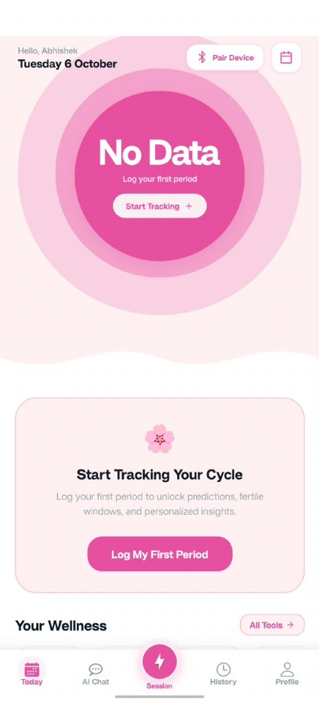
      <br />
      <em>Figure 3: Today Dashboard & Period Prediction Ring</em>
    </td>
    <td valign="top" width="55%">
      <h4>What it does:</h4>
      <ul>
        <li>Dynamic header greeting displaying the current date, user's name, and Bluetooth connection status.</li>
        <li><strong>Interactive Cycle Progress Ring</strong>: Highlights the current phase (Menstrual, Follicular, Ovulation, Luteal) or invites first-time users to <em>"Start Tracking"</em>.</li>
        <li>Direct <strong>"Log My First Period"</strong> call to action opening the period logger modal.</li>
        <li>Cycle length forecasting, fertile window indicators, and days countdown to the next anticipated period.</li>
      </ul>
      <h4>How it works:</h4>
      <ul>
        <li>Built in <code>app/(tabs)/index.tsx</code> and backed by <code>services/cycleService.ts</code>.</li>
        <li>Communicates with <code>/api/cycle/summary</code> to continuously calculate averages and project upcoming menstrual stages.</li>
      </ul>
    </td>
  </tr>
</table>

---

### 4. Holistic Wellness & Wearable Relief Hub
<table align="center">
  <tr>
    <td align="center" width="45%">
      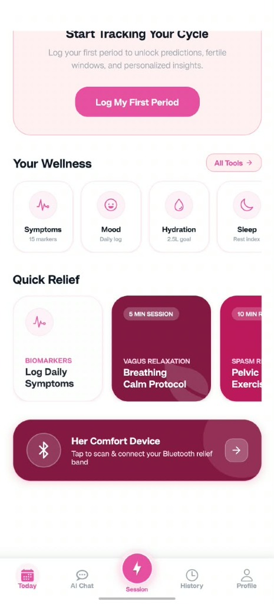
      <br />
      <em>Figure 4: Wellness Carousel & Her Comfort Connect Card</em>
    </td>
    <td valign="top" width="55%">
      <h4>What it does:</h4>
      <ul>
        <li><strong>Your Wellness Carousel</strong>: Direct access to 8 daily health tools:
          <ul>
            <li><strong>Symptoms Tracker</strong>: 15 clinical markers (cramps, fatigue, bloating, acne, etc.).</li>
            <li><strong>Mood Logger</strong>: Daily emotional status and energy logs.</li>
            <li><strong>Hydration</strong>: 2.5L daily target tracker with quick-log glasses.</li>
            <li><strong>Sleep Index</strong>: Rest hours and disturbance metrics.</li>
          </ul>
        </li>
        <li><strong>Quick Relief Protocols</strong>:
          <ul>
            <li><strong>Vagus Relaxation (5 Min)</strong>: Guided parasympathetic breathing calming protocol.</li>
            <li><strong>Spasm Release (10 Min)</strong>: Targeted pelvic floor and lower-back physical stretches.</li>
          </ul>
        </li>
        <li><strong>Her Comfort Bluetooth Device Banner</strong>: One-tap scan and connect trigger leading directly to active therapy sessions.</li>
      </ul>
      <h4>How it works:</h4>
      <ul>
        <li>Rendered in <code>app/(tabs)/index.tsx</code> with sub-routes <code>app/wellness.tsx</code>, <code>app/breathing.tsx</code>, and <code>app/exercises.tsx</code>.</li>
      </ul>
    </td>
  </tr>
</table>

---

### 5. Nari AI Health Companion (GPT-4o Health)
<table align="center">
  <tr>
    <td align="center" width="45%">
      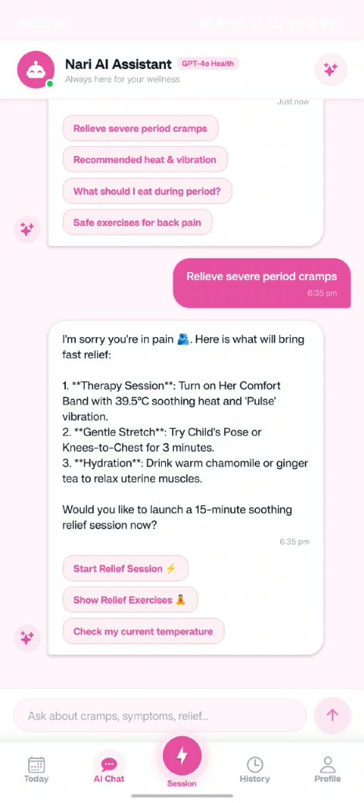
      <br />
      <em>Figure 5: Nari AI Health Assistant Interactive Consultation</em>
    </td>
    <td valign="top" width="55%">
      <h4>What it does:</h4>
      <ul>
        <li>Provides 24/7 instant medical-grade advice on menstrual symptoms, cramps, fatigue, and pain management.</li>
        <li>Features quick suggestion chips:
          <ul>
            <li><em>"Relieve severe period cramps"</em></li>
            <li><em>"Recommended heat & vibration"</em></li>
            <li><em>"What should I eat during period?"</em></li>
            <li><em>"Safe exercises for back pain"</em></li>
          </ul>
        </li>
        <li><strong>Direct Hardware Integration</strong>: Cross-references live band sensor readings (such as skin temperature) to suggest exact heat levels (e.g., 39.5°C) and vibration modes ('Pulse').</li>
        <li><strong>Interactive In-Chat Actions</strong>: Direct trigger buttons to <em>"Start Relief Session ⚡"</em>, <em>"Show Relief Exercises 🧘"</em>, or <em>"Check my current temperature"</em>.</li>
      </ul>
      <h4>How it works:</h4>
      <ul>
        <li>Implemented in <code>app/(tabs)/ai-chat.tsx</code>.</li>
        <li>Parses conversational intent and dynamically pulls real-time telemetry from <code>BluetoothContext</code> to deliver personalized therapeutic recommendations.</li>
      </ul>
    </td>
  </tr>
</table>

---

### 6. Personalized Therapy Session Pre-Configuration
<table align="center">
  <tr>
    <td align="center" width="45%">
      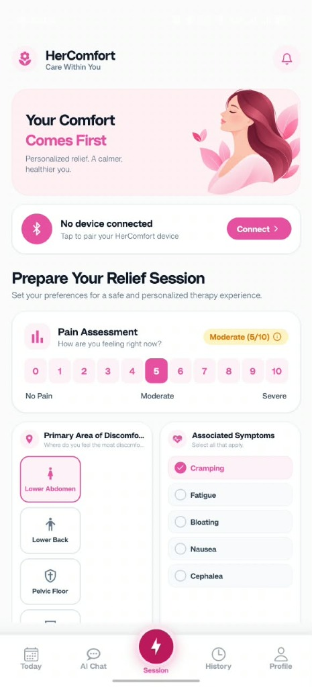
      <br />
      <em>Figure 6: Pain Assessment & Discomfort Localization</em>
    </td>
    <td valign="top" width="55%">
      <h4>What it does:</h4>
      <ul>
        <li>Pre-session clinical intake ensuring every relief therapy session is tailored to current symptoms.</li>
        <li><strong>Numeric Pain Assessment Scale</strong>: Visual slider from 0 (No Pain) to 10 (Severe), color-categorized (e.g., <em>Moderate 5/10</em>).</li>
        <li><strong>Primary Area of Discomfort</strong>: One-touch anatomical selection between <em>Lower Abdomen</em>, <em>Lower Back</em>, <em>Pelvic Floor</em>, and <em>Suprapubic</em>.</li>
        <li><strong>Associated Symptoms Multi-Select</strong>: Tracks secondary symptoms including Cramping, Fatigue, Bloating, Nausea, and Cephalea.</li>
        <li>Quick Bluetooth pairing banner if the Her Comfort band is not yet connected.</li>
      </ul>
      <h4>How it works:</h4>
      <ul>
        <li>Built in <code>app/(tabs)/session.tsx</code>.</li>
        <li>Caches the pre-session pain baseline to calculate pain delta and therapeutic efficacy at session completion.</li>
      </ul>
    </td>
  </tr>
</table>

---

### 7. Session Duration Presets & Therapy Launcher
<table align="center">
  <tr>
    <td align="center" width="45%">
      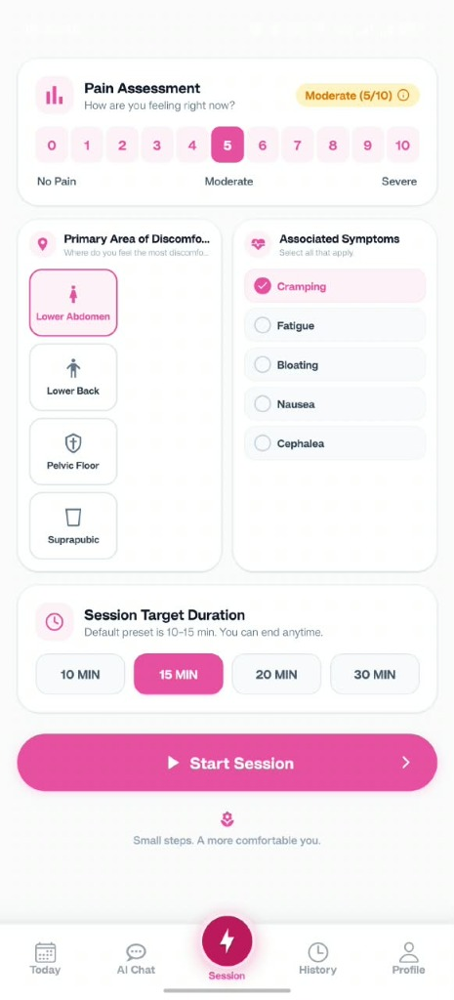
      <br />
      <em>Figure 7: Target Duration Presets & Session Launch</em>
    </td>
    <td valign="top" width="55%">
      <h4>What it does:</h4>
      <ul>
        <li>Configures the session target duration with clinical presets: <strong>10 MIN</strong>, <strong>15 MIN</strong> (default), <strong>20 MIN</strong>, or <strong>30 MIN</strong>.</li>
        <li>Allows the user to end the session early at any time or let it automatically shut down after completion.</li>
        <li>Large, accessible <strong>"Start Session >"</strong> action button that sends initial configuration commands to the ESP32-C6 band and activates live telemetry.</li>
      </ul>
      <h4>How it works:</h4>
      <ul>
        <li>Managed in <code>app/(tabs)/session.tsx</code>.</li>
        <li>Initializes the session timer, transmits the starting <code>SETPOINT</code> and <code>MODE</code> commands via Bluetooth, and records session start in <code>services/sessionService.ts</code>.</li>
      </ul>
    </td>
  </tr>
</table>

---

### 8. Clinical History & Bio-Telemetry Audits
<table align="center">
  <tr>
    <td align="center" width="45%">
      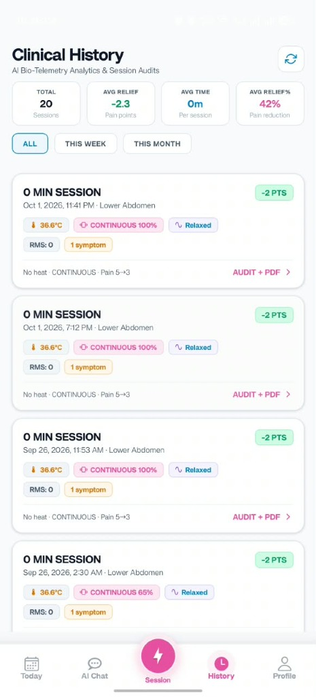
      <br />
      <em>Figure 8: Longitudinal Bio-Telemetry Analytics & Session History</em>
    </td>
    <td valign="top" width="55%">
      <h4>What it does:</h4>
      <ul>
        <li>Comprehensive medical history tracking session adherence and pain reduction over time.</li>
        <li><strong>Aggregate KPI Summary Cards</strong>:
          <ul>
            <li><strong>Total Sessions</strong> (e.g., 20 Sessions)</li>
            <li><strong>Average Relief</strong> (e.g., -2.3 Pain points)</li>
            <li><strong>Average Duration</strong> (minutes per session)</li>
            <li><strong>Average Relief %</strong> (e.g., 42% pain reduction)</li>
          </ul>
        </li>
        <li>Timeline filters: <code>ALL</code>, <code>THIS WEEK</code>, <code>THIS MONTH</code>.</li>
        <li>Detailed session cards displaying date, anatomical zone, pain reduction badge (e.g. <em>-2 PTS</em>), skin temperature (<em>36.6°C</em>), motor intensity (<em>CONTINUOUS 100%</em>), and muscle tone (<em>Relaxed</em>).</li>
        <li>Direct trigger for <strong>AUDIT + PDF ></strong> to view clinical reports or export medical records.</li>
      </ul>
      <h4>How it works:</h4>
      <ul>
        <li>Rendered in <code>app/(tabs)/history.tsx</code>.</li>
        <li>Fetches completed sessions from <code>/api/readings/session/history</code> and calculates aggregate improvement metrics.</li>
      </ul>
    </td>
  </tr>
</table>

---

### 9. AI Clinical Audit & Bioamp Telemetry Report
<table align="center">
  <tr>
    <td align="center" width="45%">
      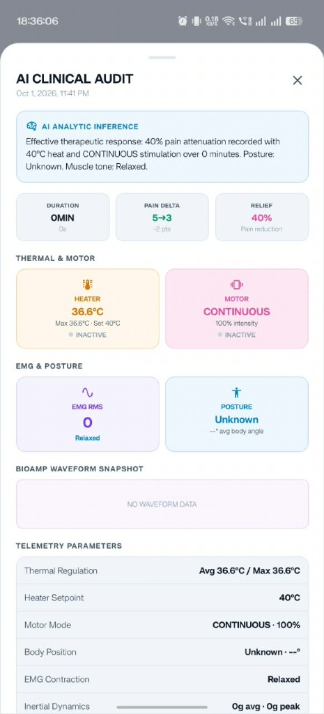
      <br />
      <em>Figure 9: AI Clinical Audit & Detailed Telemetry Diagnostics</em>
    </td>
    <td valign="top" width="55%">
      <h4>What it does:</h4>
      <ul>
        <li>Generates an in-depth clinical audit report for each completed therapy session.</li>
        <li><strong>AI Analytic Inference Banner</strong>: Clinically synthesizes session response (e.g. <em>"Effective therapeutic response: 40% pain attenuation recorded with 40°C heat and CONTINUOUS stimulation over 0 minutes. Posture: Unknown. Muscle tone: Relaxed."</em>).</li>
        <li>Key Session Metrics: Duration, Pain Delta (5 → 3, -2 pts), and Pain Reduction Percentage (40%).</li>
        <li><strong>Thermal & Motor Diagnostics</strong>: Heater temperature, max temperature, heater setpoint, motor pattern, and intensity.</li>
        <li><strong>EMG & Posture Bio-Telemetry</strong>: EMG RMS contraction value, posture classification, and body angle degrees.</li>
        <li><strong>Bioamp Waveform Snapshot</strong>: Graphical view of electromyographic muscle signals.</li>
        <li>Full Telemetry Parameters table for physician consultation or clinical review.</li>
      </ul>
      <h4>How it works:</h4>
      <ul>
        <li>Implemented in <code>app/(tabs)/history.tsx</code> as an interactive audit modal.</li>
        <li>Synthesizes pre-session and post-session telemetry data, runs the AI inference algorithm, and supports PDF export via <code>expo-print</code> and <code>expo-sharing</code>.</li>
      </ul>
    </td>
  </tr>
</table>

---

### 10. Account Profile & Edge AI Health Shield
<table align="center">
  <tr>
    <td align="center" width="45%">
      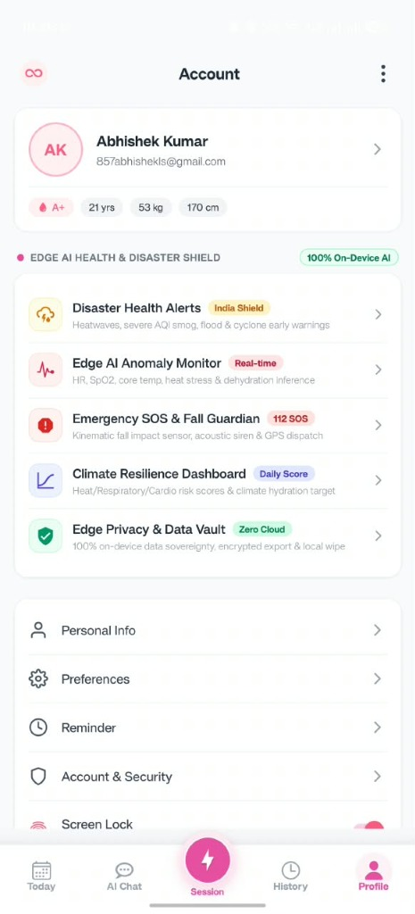
      <br />
      <em>Figure 10: User Health Profile & Edge AI Shield Hub</em>
    </td>
    <td valign="top" width="55%">
      <h4>What it does:</h4>
      <ul>
        <li>Displays user identity and essential biometrics: Blood Group (A+), Age (21 yrs), Weight (53 kg), Height (170 cm).</li>
        <li><strong>EDGE AI HEALTH & DISASTER SHIELD (100% On-Device AI)</strong>:
          <ul>
            <li><strong>Disaster Health Alerts (India Shield)</strong>: Early warnings for heatwaves, severe AQI smog, floods & cyclones.</li>
            <li><strong>Edge AI Anomaly Monitor</strong>: Real-time inference for HR, SpO2, core temp, heat stress, and dehydration.</li>
            <li><strong>Emergency SOS & Fall Guardian (112 SOS)</strong>: Kinematic fall impact sensor, acoustic alarm & GPS dispatch.</li>
            <li><strong>Climate Resilience Dashboard</strong>: Heat/cardio risk scores & climate-adjusted hydration targets.</li>
            <li><strong>Edge Privacy & Data Vault (Zero Cloud)</strong>: Local data sovereignty with encrypted export and local wipe options.</li>
          </ul>
        </li>
        <li>Direct toggles for Screen Lock, Notification Preferences, and Account Security.</li>
      </ul>
      <h4>How it works:</h4>
      <ul>
        <li>Built in <code>app/(tabs)/account.tsx</code> with edge intelligence orchestrated by <code>services/edgeAiHealthService.ts</code>.</li>
      </ul>
    </td>
  </tr>
</table>

---

### 11. Her Comfort ESP32 BLE Device Scanner
<table align="center">
  <tr>
    <td align="center" width="45%">
      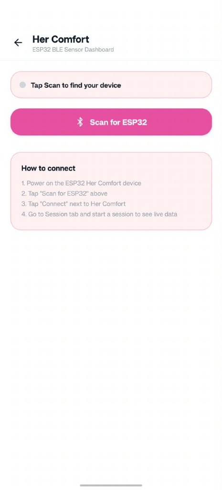
      <br />
      <em>Figure 11: Bluetooth Low Energy ESP32 Scanner & Pairing</em>
    </td>
    <td valign="top" width="55%">
      <h4>What it does:</h4>
      <ul>
        <li>Dedicated pairing dashboard for the Her Comfort ESP32-C6 wearable band.</li>
        <li>One-touch <strong>"Scan for ESP32"</strong> button discovering nearby Bluetooth Low Energy and Classic devices.</li>
        <li>Step-by-step pairing guidance ensuring effortless onboarding:
          <ol>
            <li>Power on the ESP32 Her Comfort device.</li>
            <li>Tap "Scan for ESP32".</li>
            <li>Tap "Connect" next to Her Comfort.</li>
            <li>Navigate to Session tab for live telemetry.</li>
          </ol>
        </li>
      </ul>
      <h4>How it works:</h4>
      <ul>
        <li>Implemented in <code>app/ble-device.tsx</code>.</li>
        <li>Leverages <code>services/BleService.ts</code> and <code>context/BluetoothContext.tsx</code> to scan GATT services and establish MTU-optimized communication channels.</li>
      </ul>
    </td>
  </tr>
</table>

---

### 12. Disaster Health Early Warning (India Shield)
<table align="center">
  <tr>
    <td align="center" width="45%">
      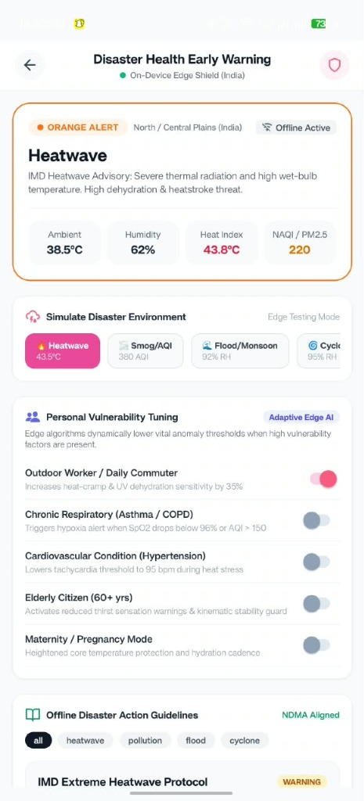
      <br />
      <em>Figure 12: On-Device Environmental & Heatwave Early Warning</em>
    </td>
    <td valign="top" width="55%">
      <h4>What it does:</h4>
      <ul>
        <li>IMD and NDMA-aligned climate health advisory (e.g., <strong>ORANGE ALERT · Heatwave</strong>).</li>
        <li>Real-time environmental telemetry: Ambient Temp (38.5°C), Humidity (62%), Heat Index (43.8°C), and NAQI/PM2.5 (220).</li>
        <li><strong>Simulate Disaster Environment</strong>: Edge testing modes for Heatwaves (43.5°C), Smog/AQI (380), Floods (92% RH), and Cyclones.</li>
        <li><strong>Personal Vulnerability Tuning</strong>:
          <ul>
            <li><strong>Outdoor Worker / Daily Commuter</strong>: Dynamically raises dehydration and heat-cramp sensitivity by 35%.</li>
            <li><strong>Chronic Respiratory (Asthma/COPD)</strong>: Lowers SpO2 hypoxia alert threshold when AQI &gt; 150.</li>
            <li><strong>Cardiovascular Condition &amp; Maternity/Pregnancy Mode</strong>: Heightened core temperature safeguards.</li>
          </ul>
        </li>
      </ul>
      <h4>How it works:</h4>
      <ul>
        <li>Implemented in <code>app/disaster-alerts.tsx</code>. Functions fully offline via pre-compiled NDMA medical guidelines and localized edge inference.</li>
      </ul>
    </td>
  </tr>
</table>

---

### 13. Reminders & Alerts Hub
<table align="center">
  <tr>
    <td align="center" width="45%">
      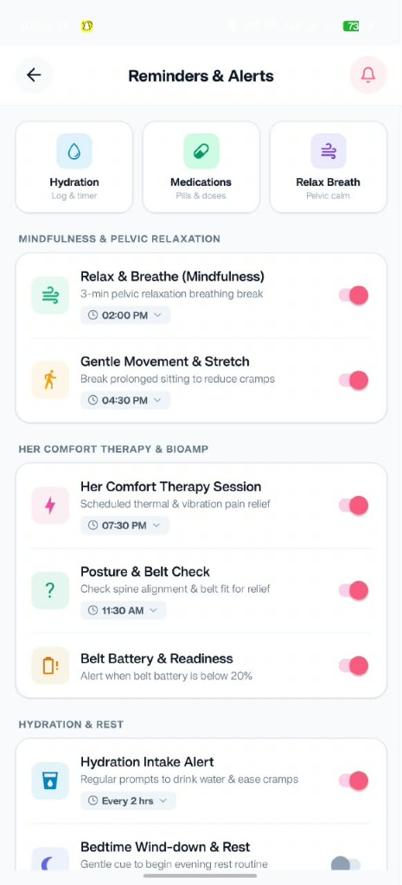
      <br />
      <em>Figure 13: Comprehensive Therapy, Posture & Mindfulness Reminders</em>
    </td>
    <td valign="top" width="55%">
      <h4>What it does:</h4>
      <ul>
        <li>Centralized notification and habit management hub with quick filter chips for Hydration, Medications, and Relax Breath.</li>
        <li><strong>Mindfulness &amp; Pelvic Relaxation</strong>:
          <ul>
            <li>Relax &amp; Breathe: 3-min pelvic relaxation breathing break (02:00 PM).</li>
            <li>Gentle Movement &amp; Stretch: Prompt to break prolonged sitting and ease cramping (04:30 PM).</li>
          </ul>
        </li>
        <li><strong>Her Comfort Therapy &amp; Bioamp</strong>:
          <ul>
            <li>Therapy Session: Scheduled thermal &amp; vibrational pain relief (07:30 PM).</li>
            <li>Posture &amp; Belt Check: Spine alignment and belt fit check (11:30 AM).</li>
            <li>Belt Battery &amp; Readiness: Low battery reminder (&lt;20%).</li>
          </ul>
        </li>
        <li><strong>Hydration &amp; Rest</strong>: Scheduled water intake alerts every 2 hours and evening bedtime wind-down prompts.</li>
      </ul>
      <h4>How it works:</h4>
      <ul>
        <li>Managed in <code>app/reminders.tsx</code> and scheduled via <code>services/notificationService.ts</code> utilizing <code>expo-notifications</code>.</li>
      </ul>
    </td>
  </tr>
</table>

---

## ⚙️ Hardware Integration & Protocol (ESP32-C6)

The **Her Comfort Wearable Band** operates on an Espressif **ESP32-C6** microcontroller supporting BLE 5.0 and Bluetooth Classic (SPP).

### 1. Inbound Telemetry Packet (Firmware → Mobile App)
Every 500ms, the wearable streams JSON telemetry over BLE Characteristic `9002` (or RFCOMM SPP):
```json
{
  "temperature": 38.50,
  "position": "UPRIGHT",
  "bodyAngle": 4.2,
  "motorMode": "HARMONIC",
  "motorSpeed": 80,
  "heater": "ON",
  "heaterSetpoint": 38.0,
  "emg": 42
}
```

### 2. Outbound Control Commands (Mobile App → Firmware)
The mobile app transmits raw UTF-8 command strings over Characteristic `9001`:
```text
MOTOR:ON               --> Engages vibration motors
MOTOR:OFF              --> Disengages vibration motors
MODE:CONTINUOUS        --> Continuous therapeutic vibration
MODE:PULSE             --> Rhythmic pulsation mode
MODE:HARMONIC          --> Frequency-swept harmonic vibration
SPEED:75               --> Sets motor intensity (0 - 100)
HEATER:ON              --> Activates thermal heating pad
HEATER:OFF             --> Shuts down thermal heating pad
SETPOINT:38            --> Sets target temperature (36°C - 40°C)
```

### 3. EMG Biofeedback Tension Scale
- `0 - 19`: **Muscle Free** (Baseline resting state)
- `20 - 34`: **Relaxed** (Normal abdominal tone)
- `35 - 49`: **Slightly Tight** (Mild muscular tension detected)
- `50 - 79`: **High Tightness** (Significant contraction; recommends heat)
- `80 - 100`: **Extreme Contraction** (Severe dysmenorrhea spasm spike)

---

## 🏗️ Repository & Directory Structure

```text
nari/
├── Nari/                               # React Native (Expo) Mobile Frontend
│   ├── app/                            # Expo Router File-Based Navigation
│   │   ├── (tabs)/                     # Primary App Tab Navigation
│   │   │   ├── index.tsx               # Today Dashboard (Cycle & Wellness Hub)
│   │   │   ├── session.tsx             # IoT Relief Band Telemetry & Control
│   │   │   ├── ai-chat.tsx             # Nari AI Health Companion Chat
│   │   │   ├── history.tsx             # Cycle History & Clinical Audits
│   │   │   └── account.tsx             # User Profile & Edge AI Hub
│   │   ├── login.tsx                   # User Authentication Screen
│   │   ├── register.tsx                # New Account Registration
│   │   ├── ble-device.tsx              # Bluetooth Device Scanner & Pairing
│   │   ├── disaster-alerts.tsx         # Disaster Health Early Warning
│   │   ├── reminders.tsx               # Reminders & Scheduled Alerts Hub
│   │   ├── symptoms-tracker.tsx        # 15-Marker Symptom Logger
│   │   ├── hydration-tracker.tsx       # Daily Water Intake Tracker
│   │   ├── mood-tracker.tsx            # Daily Mood & Energy Logger
│   │   ├── sleep-tracker.tsx           # Sleep Duration & Quality Index
│   │   ├── breathing.tsx               # Guided Vagus Nerve Calm Protocol
│   │   ├── exercises.tsx               # Pelvic Spasm Relief Stretches
│   │   └── emergency-sos.tsx           # Fall Detection & SOS Dispatch
│   ├── assets/
│   │   └── screenshots/                # Embedded UI Screenshots
│   ├── components/                     # Reusable UI & Typography Components
│   ├── context/                        # Global State Providers
│   │   ├── AuthContext.tsx             # User Authentication & Token Lifecycles
│   │   ├── AppLockContext.tsx          # 4-Digit PIN & Biometric Screen Lock
│   │   └── BluetoothContext.tsx        # BLE & Classic Bluetooth State Machine
│   ├── services/                       # API Clients & Hardware Drivers
│   │   ├── ApiService.ts               # Axios HTTP Interceptors
│   │   ├── cycleService.ts             # Menstrual Cycle Predictions
│   │   ├── sessionService.ts           # Therapy Session Logs
│   │   ├── notificationService.ts      # Push & Scheduled Reminders
│   │   └── edgeAiHealthService.ts      # On-Device Emergency & Fall Logic
│   └── package.json
│
├── backend/                            # Node.js / Express 5 API Server
│   ├── prisma/
│   │   └── schema.prisma               # Prisma Schema (MongoDB Models)
│   ├── src/
│   │   ├── config/                     # Socket.io, Mailer & Database Config
│   │   ├── models/                     # Mongoose Schemas (User, Cycle, Session)
│   │   ├── modules/
│   │   │   ├── auth/                   # Registration, Login, Google OAuth, OTP
│   │   │   ├── cycle/                  # Cycle Start/End, Predictions, Summaries
│   │   │   ├── wellness/               # Symptoms, Mood, Hydration, Sleep APIs
│   │   │   └── readings/               # Live Hardware Telemetry Streaming
│   │   ├── app.js                      # Express App Configuration & Middlewares
│   │   └── index.js                    # HTTP & Socket.io Server Entrypoint
│   └── package.json
│
└── screenshots/                        # High-Resolution Project Screenshots
    ├── 01_login_screen.jpg
    ├── 02_passcode_security.jpg
    ├── 03_today_cycle_tracker.jpg
    ├── 04_wellness_quick_relief.jpg
    ├── 05_ai_assistant_chat.jpg
    ├── 06_prepare_session_setup.jpg
    ├── 07_prepare_session_duration.jpg
    ├── 08_clinical_history.jpg
    ├── 09_ai_clinical_audit.jpg
    ├── 10_account_edge_ai_hub.jpg
    ├── 11_ble_device_scanner.jpg
    ├── 12_disaster_health_alerts.jpg
    └── 13_reminders_alerts_hub.jpg
```

---

## 🚀 Setup & Installation Guide

### Prerequisites

Ensure you have the following installed on your development machine:
- **Node.js**: `v18.x` or `v20.x` LTS ([Download Node.js](https://nodejs.org/))
- **Package Manager**: `npm` (v9+) or `yarn`
- **Expo CLI & EAS CLI**:
  ```bash
  npm install -g eas-cli
  ```
- **MongoDB**: Local MongoDB instance or free cloud database via [MongoDB Atlas](https://www.mongodb.com/atlas)
- **Android Studio & SDK** (Optional, required for local native builds):
  - Android SDK Platform 34 / 35
  - Android SDK Build-Tools
  - Configured `ANDROID_HOME` environment variable

---

### Backend Setup (Node.js & MongoDB)

1. **Navigate to the backend directory**:
   ```bash
   cd backend
   ```

2. **Install dependencies**:
   ```bash
   npm install
   ```

3. **Configure Environment Variables**:
   Create a `.env` file in `backend/` with the following variables:
   ```env
   # Database Connection
   DATABASE_URL="mongodb+srv://<username>:<password>@cluster0.mongodb.net/nari_db?retryWrites=true&w=majority"

   # JWT Authentication Secrets
   JWT_ACCESS_SECRET="your_super_secret_access_key_here"
   JWT_REFRESH_SECRET="your_super_secret_refresh_key_here"
   JWT_ACCESS_EXPIRES="15m"
   JWT_REFRESH_EXPIRES="30d"

   # Server Ports & CORS
   PORT=3000
   CORS_ORIGIN="*"
   SOCKET_CORS_ORIGIN="*"

   # Email Service (Nodemailer / Gmail OAuth2 - Optional for OTP)
   MAIL_ADMINISTRATOR="your_email@gmail.com"
   MAIL_CLIENT_ID="your_google_oauth_client_id"
   MAIL_CLIENT_SECRET="your_google_oauth_client_secret"
   MAIL_REFRESH_TOKEN="your_google_oauth_refresh_token"
   MAIL_REDIRECT_URI="https://developers.google.com/oauthplayground"
   ```

4. **Initialize Prisma Client**:
   ```bash
   npx prisma generate
   ```

5. **Start the Development Server**:
   ```bash
   npm run dev
   ```
   The backend will start at: `http://localhost:3000`  
   Test health status at: `http://localhost:3000/health`

---

### Mobile App Setup (Expo & React Native)

1. **Navigate to the mobile directory**:
   ```bash
   cd Nari
   ```

2. **Install dependencies**:
   ```bash
   npm install
   ```

3. **Configure Mobile Environment Variables**:
   Create a `.env` file in `Nari/`:
   ```env
   # Backend API Endpoint (Use your local LAN IP for physical device testing, e.g. http://192.168.1.15:3000)
   EXPO_PUBLIC_API_URL="http://192.168.1.15:3000"

   # Google Sign-In Client ID (Optional)
   EXPO_PUBLIC_GOOGLE_WEB_CLIENT_ID="your_google_web_client_id.apps.googleusercontent.com"
   ```

4. **Start the Expo Metro Bundler**:
   ```bash
   npx expo start
   ```

---

### Building Standalone APK vs Dev Client

Because Nari integrates native Bluetooth hardware drivers (`react-native-ble-plx` and `react-native-bluetooth-classic`), you should use an **Expo Development Build** or a **Standalone APK** rather than standard Expo Go.

#### Option A: Standalone Installable APK (Cloud Build via EAS)
Generates an `.apk` file that can be downloaded and installed directly on any Android device without needing a Metro server running:
```bash
cd Nari
eas build --platform android --profile preview
```

#### Option B: Run Locally on a Connected Android Phone / Emulator
Ensure USB debugging is enabled on your phone and run:
```bash
cd Nari
npx expo run:android
```

#### Option C: Build Standalone Release APK Locally (Offline with Gradle)
If you have Android Studio and the Android SDK installed locally:
```bash
cd Nari/android
./gradlew assembleRelease
```
The resulting APK will be generated at:
`Nari/android/app/build/outputs/apk/release/app-release.apk`

---

## 🔌 API Endpoints Reference

### 1. Authentication (`/api/auth`)
- `POST /api/auth/register` — Create a new user account.
- `POST /api/auth/login` — Authenticate credentials and return JWT tokens.
- `POST /api/auth/refresh` — Refresh expired access token.
- `POST /api/auth/send-otp` — Send an email verification OTP.
- `POST /api/auth/verify-otp` — Verify OTP code.
- `POST /api/auth/google` — Exchange Google OAuth token for session.

### 2. Cycle Intelligence (`/api/cycle`)
- `POST /api/cycle/start` — Record start of a new menstrual period (flow level, symptoms).
- `POST /api/cycle/end` — Log period conclusion.
- `GET /api/cycle/summary` — Fetch current cycle phase, next predicted period, and fertile window.
- `GET /api/cycle/history` — Retrieve historical cycle logs.
- `DELETE /api/cycle/:id` — Delete a specific cycle entry.

### 3. Wellness & Telemetry (`/api/wellness`)
- `POST /api/wellness/log` — Record daily symptoms, mood, sleep, or hydration intake.
- `GET /api/wellness/today` — Retrieve today's logged biomarker summary.
- `GET /api/wellness/history` — Get longitudinal trend reports.

### 4. Hardware Telemetry & Sessions (`/api/readings`)
- `POST /api/readings/session/start` — Initiate a relief therapy session.
- `POST /api/readings/session/end` — Conclude session and save aggregated metrics (avg temp, max EMG, posture).
- `GET /api/readings/session/history` — Retrieve past therapy sessions and efficacy ratings.

---

## 🔐 Privacy & Security Guardrails

- **Zero Unencrypted Reproductive Data**: Health notes, cycle dates, and symptom logs are secured with transport-layer SSL/TLS and encrypted database stores.
- **Biometric & PIN Application Lock**: Protected by `AppLockContext`, prompting for biometrics or a user-defined 4-digit PIN whenever the app is reopened.
- **Hardware Isolation**: Bluetooth pairing only connects with authenticated Her Comfort devices matching validated BLE UUIDs and signatures.
- **Decentralized Fall Detection & Disaster Shield**: Kinematic impact analysis and NDMA safety advisories run locally on the phone to guarantee immediate emergency operations even without active cellular network coverage.

---

## 📸 Adding Future Screenshots

Whenever you capture additional screens:
1. Place the image in `screenshots/` and `Nari/assets/screenshots/`.
2. Reference the image in this `README.md` using:
   ```html
   
   ```
3. Commit and push your changes!

---

<p align="center">
  Made with 💖 for women's health and everyday comfort.
</p>
